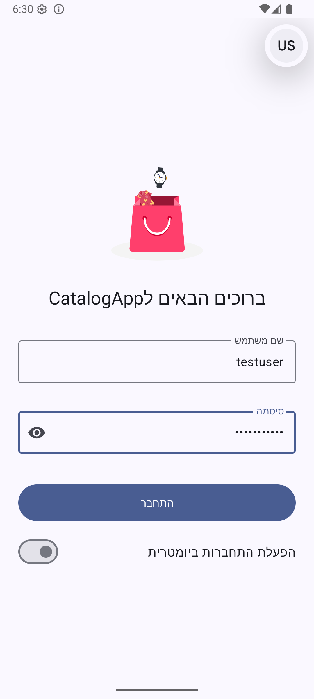
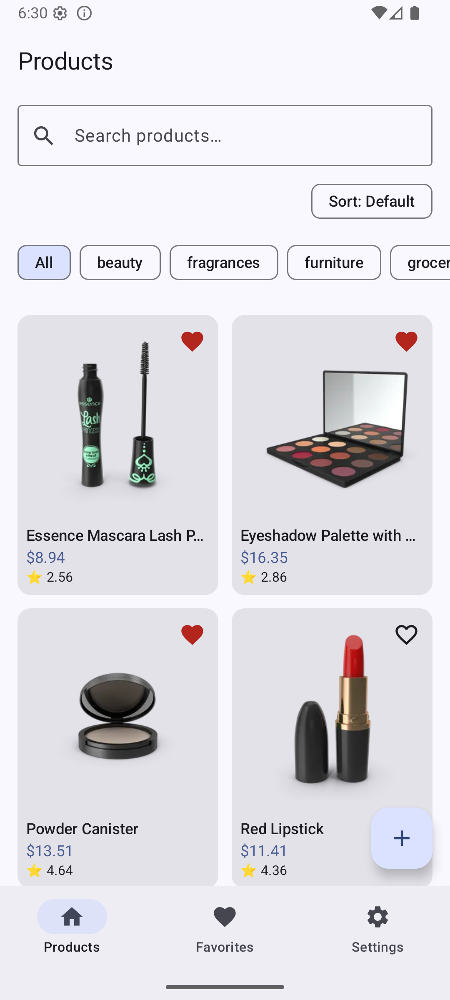
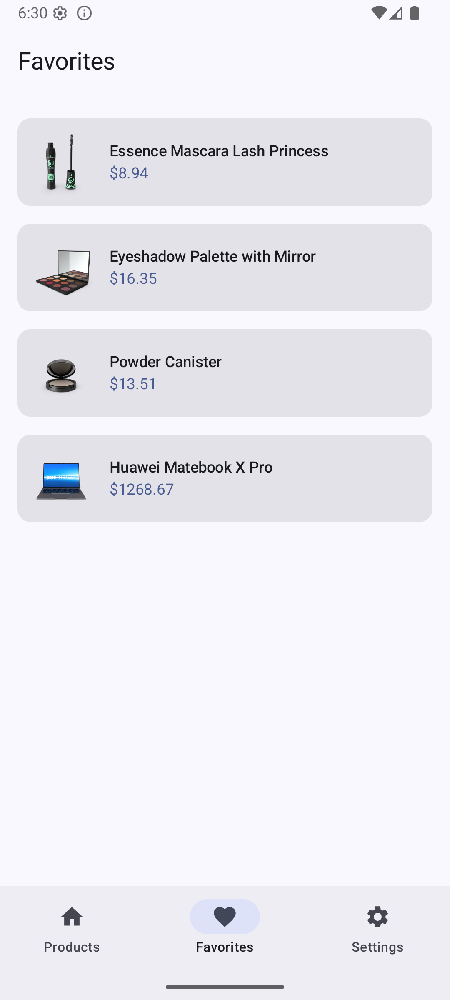
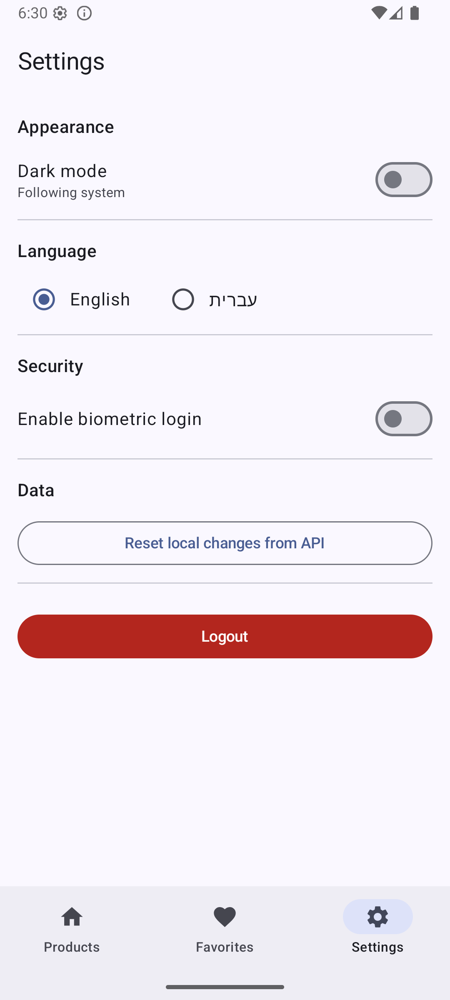

# CatalogApp

A modern Android application demonstrating Clean Architecture, MVVM, offline-first data handling, and Jetpack Compose with Material 3. Built as a take-home assignment focused on architecture, code quality, and maintainability.

## Features

- **Authentication**: username/password login with validation and loading states, biometric re-authentication, persistent session via DataStore, Lottie animation on the login screen.
- **Products**: paginated product list (Paging 3) from [dummyjson.com](https://dummyjson.com/products), search, sort, category filtering, product detail with image carousel and reviews, offline caching via Room.
- **Favorites**: add/remove, persisted in Room, swipe-to-remove with Snackbar "Undo".
- **Settings**: dark/light mode, language switching (English/Hebrew with RTL), biometric toggle, logout, "Reset local changes from API".
- **CRUD**: add/edit/delete products locally (offline-only — see Known Limitations), with a "Reset local changes" action that restores the catalog from the API.

## Screenshots

| Login | Products | Favorites | Settings |
|---|---|---|---|
|  |  |  |  |

## Tech Stack

| Category | Choice |
|---|---|
| Language | Kotlin |
| UI | Jetpack Compose + Material 3 |
| Architecture | MVVM + Clean Architecture, multi-module |
| Async | Coroutines + Flow |
| DI | Hilt |
| Networking | Retrofit + OkHttp + kotlinx.serialization |
| Local Storage | Room + DataStore |
| Pagination | Paging 3 (with RemoteMediator) |
| Images | Coil |
| Navigation | Navigation Compose, type-safe routes, nested graphs |
| Animation | Lottie |

## Setup

1. Clone and open in Android Studio.
2. Let Gradle sync (AGP 8.7.2, Kotlin 2.0.21, compileSdk 36, minSdk 24).
3. Run on an emulator or device (API 24+) — no API key or backend setup needed, uses the public [dummyjson.com](https://dummyjson.com) API.

### Login Credentials

| Username | Password |
|---|---|
| `testuser` | `password123` |
| `admin` | `admin123` |

Biometric login can be enabled from Settings (requires biometric enrollment on the device/emulator).

## Architecture

Four Gradle modules:

```
:core:domain   — pure Kotlin: models, repository interfaces, use cases
:core:data     — Room, Retrofit, DataStore, repository implementations
:feature       — all UI: screens, ViewModels, navigation, theme
:app           — composition root: MainActivity, Application, DI entry point
```

Dependency direction is one-way: `:feature` depends only on `:core:domain` (repository *interfaces*, not implementations); `:app` depends on everything and wires the Hilt graph. The UI layer has no knowledge of Room, Retrofit, or DataStore.

**Notable design decisions:**

- **Offline-first**: Room is the single source of truth, with a Paging 3 `RemoteMediator` keeping it updated from the API. Local edits (`isLocallyModified`) survive refresh.
- **Local-only CRUD**: since `dummyjson.com` doesn't persist writes, creates/edits/deletes are tracked with local flags, with a "Reset local changes" action to restore from the API.
- **Error handling**: Paging load/error/empty states with retry; `ProductDetailUiState` (`Loading`/`Success`/`NotFound`) avoids an indefinite spinner for uncached products offline; form validation via `AuthError`/`ProductError` enums with exhaustive `when` mapping to localized strings.
- **Auth + biometrics**: persistent session and biometric re-auth are independent, additive — biometric (when enabled) shows as a prompt on top of the Login screen as an extra gate.
- **Localization**: English/Hebrew with full RTL, including a `values-iw` qualifier needed for correct resource resolution on the tested Android version.

## Testing

- `ValidateLoginInputUseCaseTest`, `ValidateProductInputUseCaseTest` (`:core:domain`)
- `ProductMapperTest` (`:core:data`)
- `AuthViewModelTest` (`:feature`, with a fake repository)

## Known Limitations

- CRUD doesn't sync to a real backend (`dummyjson.com` is read-only/mock).
- Authentication is a local mock with hardcoded test credentials.
- `:core:domain`/`:core:data` are combined per layer rather than split per-feature; internal package structure (`model/`, `repository/`, `usecase/`) preserves the same boundaries and could be split further if the app grew.

---

# AI Usage Report

## AI Tools Used

- **Claude Code** — code generation and automatic refactors (extracting use cases, string resources, splitting components).
- **Claude (claude.ai)** — architectural decisions and debugging.

## What AI Assisted With

- Resolving Gradle/build configuration issues, and general debugging.
- Code generation for screens, ViewModels, repositories, Room/Retrofit/DataStore, and Hilt wiring.
- Automatic refactoring: extracting validation logic into use cases, converting hardcoded strings to localized resources, splitting large composables into smaller components.

## What Was Implemented or Reviewed Manually

- Architecture decisions (Clean Architecture layering, multi-module split, offline-first repository design).
- Every generated/refactored piece of code was reviewed before being accepted — a recurring pattern was first drafts being one large composable or `UiState` defined inline in a ViewModel; redirected with prompts to split into smaller components (e.g. `FavoriteListItem`, `LanguageOption`) and move `UiState` into its own file.
- All features manually tested on an emulator.

## Example Prompts Used

1. *"Extract the validation logic from `AuthViewModel.login()` into a `useCase` in the domain layer, with an error enum for the different validation failures. Update the ViewModel and UI to use it."*

2. *"When updating product details, it updates changes in `ProductListScreen`, but when I pull down for refresh it shows the original price."* — led to fixing the `RemoteMediator` to track an `isLocallyModified` flag and exclude locally-edited products from being overwritten on refresh.

3. *"Split `ProductListScreen` into smaller UI components."*

## How Correctness and Code Quality Were Verified

- Code review on every AI-suggested change — rejected and redirected when not in the right direction.
- Manual testing on an emulator after each change.
- Running unit tests on each change to check whether existing logic broke.